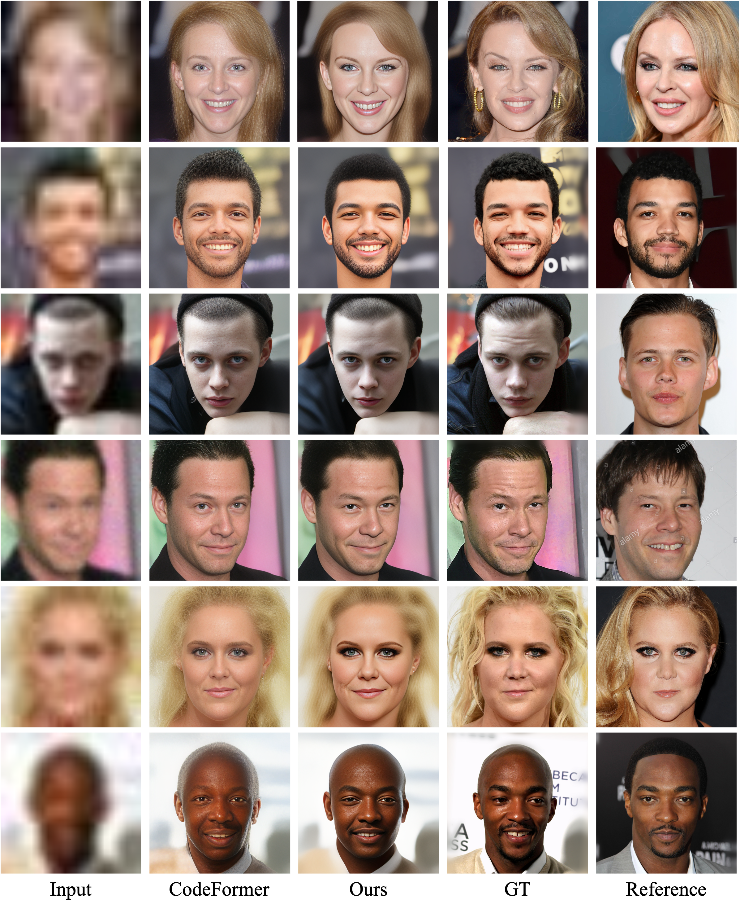
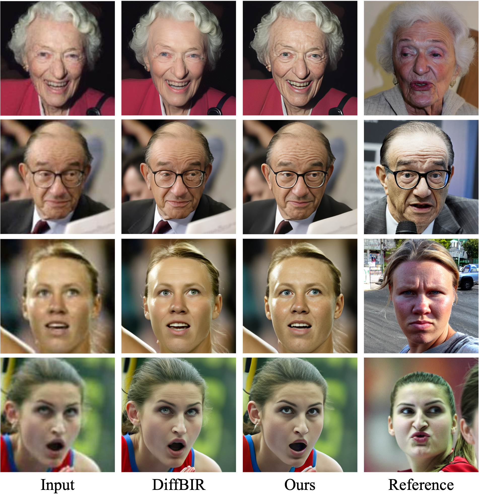

# Progressively Identity-Preserving Transformer for Reference-based Blind Face Restoration
Eun-Seong Kim\* , Min-Yeong Kim\*, Yejun So, and Keunsoo Ko&dagger;

<h3> Comparative Comparisions </h3>
For more comparisons, please refer to [here](./comparison/).

